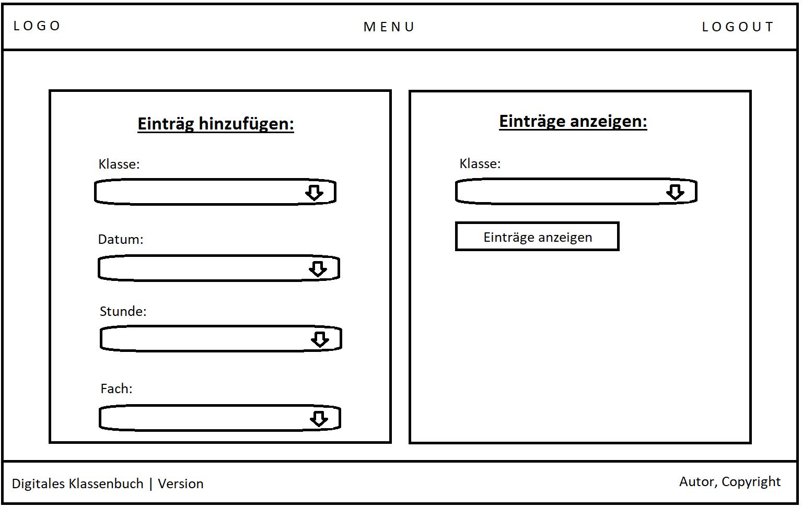

# Digitales Klassenbuch

Dieses Projekt entstand im Rahmen eines Schulprojektes zur Vorbereitung auf die Abschlussprüfung im Jahre 2019. Thema war die Digitalisierung an deutschen Schulen. Dieses Projekt befasst sich mit der Entwicklung eines digitalen Klassenbuchs zur einfacheren Verwaltung des Schulablaufs.

Note: Dieses Projekt ist nur ein Prototyp und nicht geeignet für einen produktiven Betrieb.

# Features
- Persistente Speicherung der Daten in einer Datenbank
- Authentifizierung der Benutzer und Protokollierung der Aktivitäten
- Protokollierung der Unterrichtsthemen, Hausaufgaben und Stundenplanänderungen

# Aufbau
Das Klassenbuch wird dem Nutzer über ein interaktives Webinterface zur Verfügung gestellt. Zur Darstellung der dynamischen Inhalte wird die serverseitige Skriptsprache [PHP](https://de.wikipedia.org/wiki/PHP) verwendet. Als Datenbank wird eine [MySQL](https://de.wikipedia.org/wiki/MySQL)-Datenbank verwendet.




## Installation
Zur Installation des digitalen Klassenbuchs benötigt man einen Webserver mit funktionsfähigem PHP-Interpreter. Gängige Webserver sind z.B. [Apache2](https://de.wikipedia.org/wiki/Apache_HTTP_Server) oder [NGINX](https://de.wikipedia.org/wiki/Nginx).

Zur Einrichtung der Datenbank(Benutzer und Tabellen) existiert ein vorgefertigtes [Skript](./db-setup.sql), welches die Einrichtung übernimmt. Hierbei muss lediglich der Benutzername und das Passwort angepasst werden.

Anschließend müssen die Verbindungsdaten der Datenbank dem digitalen Klassenbuch mitgeteilt werden. Hierzu wird die Datei ([/includes/config.php](./includes/config.php)) aufgerufen.

```bash
// IP- oder Host-Adresse der Datenbank
// Optional mit Angabe der Portnummer (Standard: 3306)
// Beispiel: 192.168.1.0:3306
// Die Felder mit < > sind auszufüllen
define('DB_HOST', '<host-address>');

// Benutzername der Datenbank
define('DB_USER', '<db-user>');

// Passwort zum Benutzer der Datenbank
define('DB_PASSWORD', '<db-password>');

// Der Name der zu nutzenden Datenbank
define('DB_DATABASE', '<db-database>');
```

## Einrichtung eines Benutzers
Da dieser Prototyp gegenwärtig keinen automatisierten Installationsprozess unterstützt, müssen die Nutzer manuell erstellt werden. Hierzu wird folgender SQL-Befehl benötigt.

```bash
INSERT INTO Nutzer(Benutzername, Vorname, Nachname, Email, Geburtsdatum, Rolle_Id, Passwort)
VALUES (
    'max.mustermann',
    'Max',
    'Mustermann',
    'max.mustermann@mustermail.de',
    '2000-01-01',
    1, /* Benutzergruppe, nicht implementiert bisher */
   '<password-hash>'
);
```
Zur Erzeugung des <password-hash> wird SHA-512 verwendet. [(SHA-512 online generieren)](https://hashgenerator.de/)

## Nutzung
Zur Nutzung des digitalen Klassenbuchs ist die Adresse des Webservers in einem gängigen Browser aufzurufen. Anschließend erfolgt die Anmeldung mit den Nutzerdaten, welche im vorherigen Schritt erstellt wurden.

## License
[MIT](./LICENSE.md)